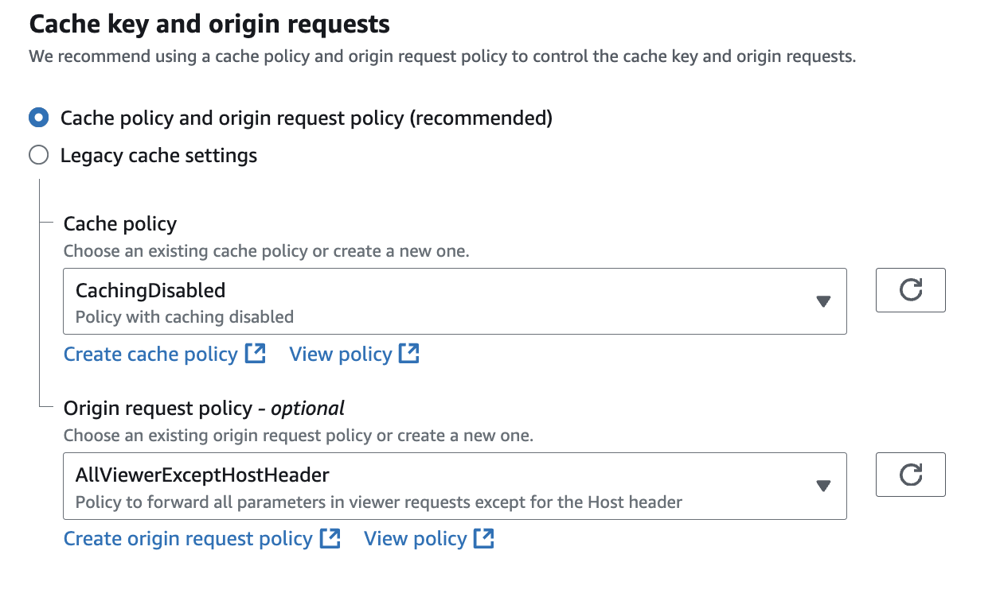

AppRunner is a relatively new service from AWS that allows you to host your web services in a fully managed environment. You can think of it as a more modern version of Elastic Beanstalk, or AWS alternative to Heroku.
It's fully docker-based, all you need is to provide a container image (e.g. from ECR), specify the CPU and memory and AppRunner will take care of the rest.
You can override some settings, like listening port, command to run, environments variables, healthcheck path, etc.
What's really cool about AppRunner is very simple auto-scaling configuration. Additionally you should be aware of specific pricing model: you have to pay for memory all the time your service is up, and for CPUs only when they are actually used, i.e. when they process requests. So, kind of pay for your load for CPU, but pay constant price for memory. This is different from all the other AWS compute services - like EC2, Fargate, Lambda.

But this post is not about AppRunner, and I would not even advertise it, because I think it's still quite limited and raw product. Some of the simple features are waiting some enourmous time in github issues. E.g., [this issue](https://github.com/aws/apprunner-roadmap/issues/192) is about allowing to use private VPC resources and public internet at the same time, something that you expect to be supported out of the box. In my opinion AppRunner is not the best product of AWS, and ECS configured on top of Fargate or EC2 is still the best choice for most of the scalable web applications.

But AppRunner has some advantages: it's still easier than ECS to configure, pricing model could be more suitable for small applications, and it has auto-deployment just by pushing new image to ECR^[I like this feature a lot, you don't need to setup any CI/CD, except for building the image and pushing it to ECR. Althouth there're some problems with this very simple CD model: how to run some one-time tasks, such as database migrations, before the server update. Basically, you're forced to run such tasks as part of your container entrypoint/command.]. So if it happened that you're using it, there's some problem with connecting it to CloudFront.

# TLSv1

# Caching policy

{#fig-screen-cloudfront-policies}

{#fig-screen-cloudfront-policies}

