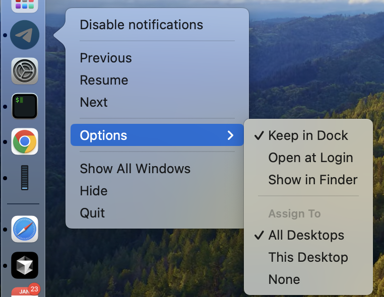

## What's the point?

The case is, MacOS has a bit strange window management, and definitely sucks when it comes to managing multiple workspaces (desktops). The latter is called here interchangeably either as "Spaces" or "Desktops",
and whole this functionality is called "Mission Control".

It's strange, stupid, unusable on default configuration, but -- you can harness it more or less with help of several things. 

All here is purely subjective, and based on my personal taste.

## 2 types of applications

In my mind I've separated applications into 2 types:

1. All-spaces applications, such as Telegram or ChatGPT, which could be opened in any space. They are single-window applications (e.g. no reason to have several windows of chat application opened).
2. Space-specific applications, such as VSCode or Google Chrome, which should be opened in a specific space (e.g. at work projects), and sticky to that space. They are typically multi-window applications.

In the Dock you can configure how they are displayed across spaces (Desktops):

* **All Desktops** - their single window will be opened always in your current space (for all-spaces applications).
* **None** - once you opened a new window, it will stay in this space (for space-specific applications).



## Some space-specific apps require shortcuts to open

In my case, those are browser and terminal, who require shortcuts to open.
Why that's the case?
Imagine you have created a new space for some hobby project, or even for some quick task.
Almost always you need a browser opened here, and terminal is quite often needed in case it's about coding.
If you just click on the browser icon in the Dock, or run it from spotlight -- it will annoyingly switch you to the a space where this app is already opened. Such a stupid behavior!

You're forced to make several clicks in the Dock ("New Window") 🥺.

There're 2 solutions.

### Swith to app without window

It works if you disabled "...Switch to a space with opened windows...". Btw, it's better to do this anyway, 
unless you want to be randomly swithched from time to time🤕.


Then it works like this:

1. Switch to Chrome / *your browser* application using your Application Switcher(⌘ + Tab).
2. At this moment, you don't see the browser opened - because it's opened in a different space. But despite you don't see it, it's selected as current application.
3. Open a new window (⌘ + N).

It works. But the second step is such a confusing one!

### Create a global shortcut
Thanks god, it's not very difficult (although not so simple as it could be) to create a shortcut for that.
One reference is [here](https://medium.com/@an23lm/shortcut-to-open-new-chrome-window-28ffeaad0d80).

Here's an AppleScript for iTerm2:

```applescript
on run {input, parameters}
	
	tell application "iTerm"
		activate
		create window with default profile
	end tell
	
end run
```

**Steps**:
1. Open Automator and create a new Quick Action (set Workflow receives="no input" in "any application") 

2. Specify correct AppleScript

3. Go to System Settings > Keyboard > Keyboard Shortcuts -> Services -> General, and set a shortcut for your automator action.


Why I don't need shortcut for another apps, e.g. VSCode? Because I usually open it from the terminal: `code .`

## Disable animation

At some point I've realized that slow spreading of windows when switching to spaces overview (Mission Control) is most annoying for my eyes.

macOS offers a ‘Reduce Motion’ setting that simplifies system animations, resulting in quicker transitions.

Steps:
1.	Open System Preferences and select Accessibility.
2.	In the left sidebar, choose Display.
3.	Check the box labeled Reduce Motion.

## Shortcuts for switching to a space by number

In addition to **Move left a space** and **Move right a space** shortcuts, you can use **Switch to Space 1**, **Switch to Space 2**, etc.

To enable this, go to System Preferences -> Keyboard -> Shortcuts -> Mission Control (expand the list) and enable **Switch to Space 1**, **Switch to Space 2**, etc., up to 9. For some reason, they are disabled by default 😯.

This way you can remember that you have a work open at space 1, some hobby project at space 2, etc., and quickly switch to them. Without annoying animation!

